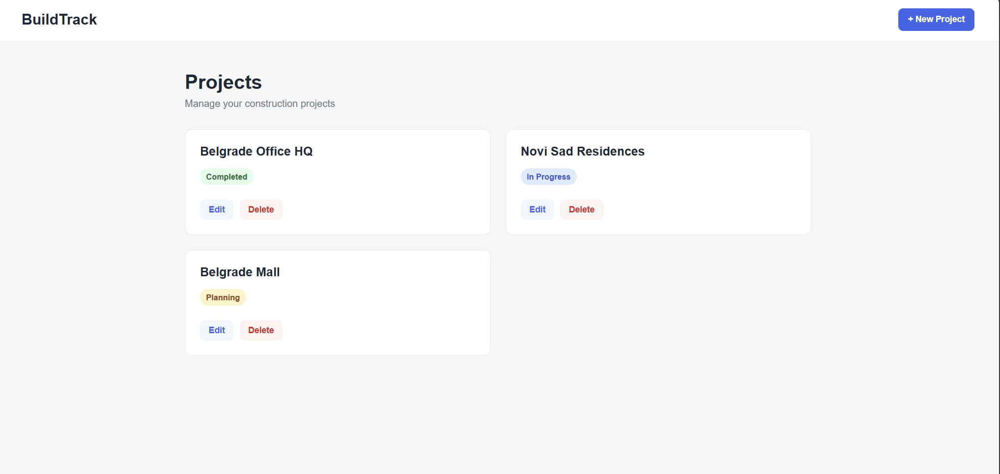

# BuildTrack

BuildTrack is a full-stack construction project management application designed to manage construction projects and track their current status.

## Screenshots



## Features

* Create new construction projects
* View all projects
* Edit existing projects
* Delete projects with confirmation
* Project status validation
* Loading and error states
* Responsive design
* PostgreSQL database
* REST API

## Tech Stack

### Frontend

* React
* Vite
* JavaScript
* CSS

### Backend

* Python
* FastAPI
* SQLAlchemy
* Pydantic

### Database

* PostgreSQL

## Architecture

```text
React
  ↓
FastAPI
  ↓
SQLAlchemy
  ↓
PostgreSQL
```

The React frontend communicates with the FastAPI backend through REST API endpoints.

## CRUD Operations

BuildTrack supports the complete CRUD workflow:

* **Create** — `POST /projects`
* **Read** — `GET /projects`
* **Update** — `PUT /projects/{project_id}`
* **Delete** — `DELETE /projects/{project_id}`

## Project Structure

```text
BuildTrack/
│
├── backend/
│   ├── main.py
│   ├── database.py
│   └── models.py
│
├── frontend/
│   ├── src/
│   │   ├── App.jsx
│   │   ├── ProjectCard.jsx
│   │   ├── api.js
│   │   └── index.css
│   └── package.json
│
├── screenshots/
│   └── dashboard.png
│
├── .gitignore
└── README.md
```

## Running Locally

### Backend

Navigate to the backend directory:

```bash
cd backend
```

Create and activate a Python virtual environment if needed, then install the dependencies:

```bash
pip install fastapi uvicorn sqlalchemy psycopg2-binary python-dotenv
```

Create a `.env` file inside the `backend` directory:

```text
DATABASE_URL=your_database_url
```

Start the FastAPI development server:

```bash
fastapi dev main.py
```

The API will be available at:

```text
http://127.0.0.1:8000
```

Interactive API documentation is available at:

```text
http://127.0.0.1:8000/docs
```

### Frontend

Open another terminal and navigate to the frontend directory:

```bash
cd frontend
```

Install the dependencies:

```bash
npm install
```

Start the development server:

```bash
npm run dev
```

## API Endpoints

| Method | Endpoint                 | Description          |
| ------ | ------------------------ | -------------------- |
| GET    | `/projects`              | Get all projects     |
| POST   | `/projects`              | Create a new project |
| PUT    | `/projects/{project_id}` | Update a project     |
| DELETE | `/projects/{project_id}` | Delete a project     |

## Validation

Project statuses are validated on the backend using a Python Enum and Pydantic.

Allowed statuses:

* Planning
* In Progress
* Completed

The frontend also uses a dropdown to prevent invalid status values from being entered through the UI.

## Future Improvements

* User authentication
* Project deadlines
* Project details
* Task management
* Search and filtering
* Dashboard statistics
* User roles and permissions
* Production deployment

## Author

Simona
